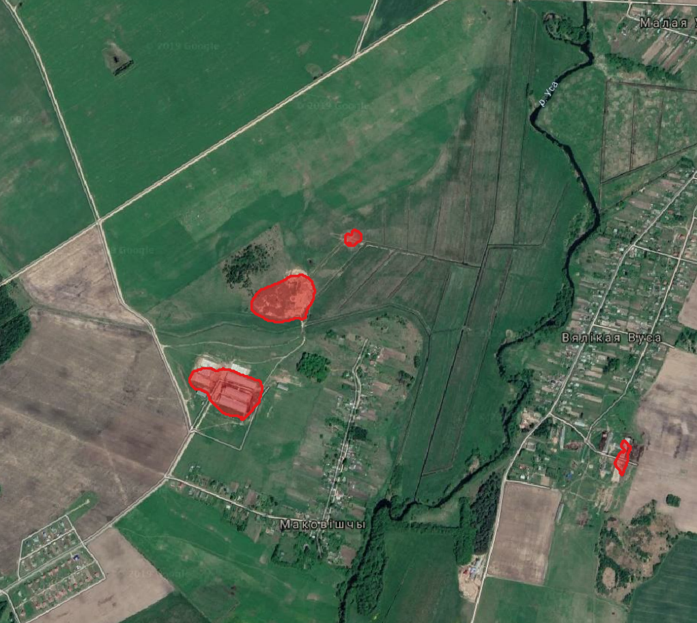

# Quarry segmentation searcher (sentinel2)

Simple search for quarry areas by sentinel2
images (only inference part)

### Project dependencies:
 - [Keras](keras.io)/[Tensorflow-1.x](www.tensorflow.org) as DL framework 
 - [GDAL](gdal.org) as core geo-library
 - [GeoPandas](geopandas.org)/[Fiona](fiona.readthedocs.io) as lite-abstarction library for geometry
 - [Python](python.org) >= 3.7 as glue :) 
 - numpy/scipy/scikit-image/scikit-learn as DS/CV python stack
 - [FELS](https://github.com/vascobnunes/fetchLandsatSentinelFromGoogleCloud): simple CLI for google-cloud sentinel2 downloading
 - ... and much more

To avoid hell of library dependencies and
application deployment and launch use the
[Docker-file](docker/readme_docker.md) in project.


#### Usage example (python-commands, )
The distribution directory will be referred to below as $ wdir


###### (1) download sentinel2 example data
fels utility can be used for these purposes
(pros: fast downloading from free google-cloud sentinel2 storage)

```bash
fels 35UNV S2 2017-09-20 2017-09-30 -c 0.1 -o data_s2
```

###### (2) convert&comress raw sendownload sentinel2 example data
convert data and move into $wdir/data directory 

```bash
python $wdir/compress_sentinel_l1c.py -i=data_s2/S2A_MSIL1C_20170926T092021_N0205_R093_T35UNV_20170926T092024.SAFE/GRANULE/L1C_T35UNV_A011816_20170926T092024/IMG_DATA
mv data_s2/S2A_MSIL1C_20170926T092021_N0205_R093_T35UNV_20170926T092024.SAFE/GRANULE/L1C_T35UNV_A011816_20170926T092024/IMG_DATA/s2_u8.jp2 $wdir/data/s2_u8_35UNV_2017-09-26.jp2

```

###### (3) prepare images for regions
preapre with a qgis geometry of regions-of-intereset and clip compressed s2-data
with this geometry. For example you can use $wdir/data/data_test/s2_u8_35UNV_geom1.gpkg geom

```bash
python clip_raster_by_geom.py -i=$wdir/data/data_test/s2_u8_35UNV_2017-09-26.jp2 -g=$wdir/data/data_test/s2_u8_35UNV_geom1.gpkg -a=type
```

###### (4) generate probability map and vectorized geometry
for example you can use $wdir/data/test_data/s2_u8_35UNV_2017-09-26_t4.tif file

```bash
python quarry_searcher_s2_pmap.py -i=$wdir/data/data_test/s2_u8_35UNV_2017-09-26_t4.tif -c=$wdir/model/model_cfg.json
```

at the end you will get two additional files,
a raster one with a probability map (*_pmap.tif)
and vector (*_pmap_vec.gpkg) with the boundaries of
the quarries found:

you can use qgis to visualize the results:



---


 #### Usage example (with a Docker)
 
 Please read additional [docker-support doc](docker/readme_docker.md)

