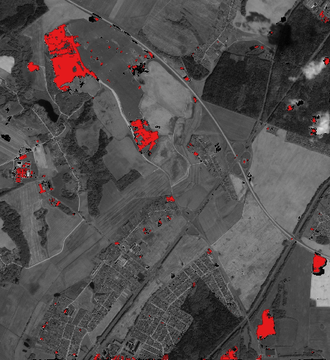

# BKA (Belarusian Space Apparatus) images processing: quarry mask prediction

Simple preprocessing & quarry mask inference for BKA images (only inference part)


### Project dependencies:
 - [pytoch](pytorch.org)/[onnx](onnx.ai) as DL/DL-Inference framework 
 - [GDAL](gdal.org) as core geo-library
 - [GeoPandas](geopandas.org)/[Fiona](fiona.readthedocs.io) as lite-abstarction library for geometry
 - [Python](python.org) >= 3.6 as glue :)
 - [Docker](docker.io) as runtime environemt
 - opencv/numpy/scipy/scikit-image/scikit-learn as DS/CV python stack
 - ... and much more


In the next sections we assume that variable $wdir stores the path to the root of this repository directory

### Prepare docker env
To avoid hell of library dependencies and
application deployment and launch we use the Docker

###### (1) pull ready-to-use docker images from docker-hub (preferred)

```bash
cd $wdir/bka_segm_api/docker
make docker-pull

```

or
###### (2) build docker images from docker files (GPU & CPU versions)

```bash
cd $wdir/bka_segm_api/docker
make docker

```

#### Usage example (CLI-commands)

To test CLI BKA segmentation api, please download and unzip from
[test-data](https://yadi.sk/d/XO0RSBOwHrQw5g) into directory ```$wdir/bka_segm_api/data-test```  


The BKA CLI-API in this repository includes three CLI utilities:
- two for preprocessing BKA image data ([crop by polygons](../run/bka_crop_images_by_geom.py) &  [crop by bbox](../run/bka_crop_images_by_geom.py))
- one for inference ([mask inference](../run/bka_predict_mask.py))


###### (1) Clip image by geometry file
To split every polygon into different crop, please use ```--no_split==1```
fels utility can be used for these purposes
(pros: fast downloading from free google-cloud sentinel2 storage)

In the next steps we define two variable with CPU/GPU containers names:
cpu:
```bash
CONTAINER_CPU="alxkalinovsky/uiip-dl-bka-cpu:latest"
```
and GPU:
```bash
CONTAINER_GPU="alxkalinovsky/uiip-dl-bka-gpu:latest"
```

and run: 
```bash
cd $wdir
docker run -v=$PWD/data-test/sample01:/data -v=$PWD:/src -w=/src -it alxkalinovsky/uiip-dl-bka-cpu:latest \
    python3 -m run.bka_crop_images_by_geom \
    /data/4064423-0220-PAN-C-1-1-1232982-190827T085538-BY.tif \
    /data/4064423-0220-MUL-C-1-1-1232982-190827T085538-BY.tif \
    /data/geom-4064423-0220.gpkg \
    --no_split \
    --out=/data/clip_geom
```


###### (2) Clip image by boundig box in Lon/Lat coordinates (WGS84 CRS)

plese use nex CLI command:

```bash
cd $wdir
docker run -v=$PWD/data-test/sample01:/data -v=$PWD:/src -w=/src -it alxkalinovsky/uiip-dl-bka-cpu:latest \
	python3 -m run.bka_crop_images_by_bbox \
	-p=/data/4064423-0220-PAN-C-1-1-1232982-190827T085538-BY.tif \
    -m=/data/4064423-0220-MUL-C-1-1-1232982-190827T085538-BY.tif \
    -o /data/clip_bbox \
    --bbox=27.28737,53.75080,27.37857,53.85420
```


###### (3) Predict mask for paired PAN/MUL BKA images

You can use CPU or GPU version of docker-image for inference (GPU version 3-10 times fasted)

for CPU version:

```bash
docker run -v=$PWD/data-test/sample01:/data -v=$PWD:/src -w=/src -it alxkalinovsky/uiip-dl-bka-cpu:latest \
    python3 -m run.bka_predict_mask \ 
    -p=/data/clip_bbox_PAN.tif \
    -m=/data/clip_bbox_PAN.tif \
    -o /data/clip_bbox_cpu
```


or GPU version:
```bash
docker run --gpus=all -v=$PWD/data-test/sample01:/data -v=$PWD:/src -w=/src -it alxkalinovsky/uiip-dl-bka-gpu:latest \
    python3 -m run.bka_predict_mask \ 
    -p=/data/clip_bbox_PAN.tif \
    -m=/data/clip_bbox_PAN.tif \
    -o /data/clip_bbox_gpu
```


To split every polygon into different crop, please use ```--no_split==1```
fels utility can be used for these purposes
(pros: fast downloading from free google-cloud sentinel2 storage)


###### (4) Test all CLI utilites

To test all utilites, please use simple make-file based tests in this repository:

```bash
cd $wdir/bka_segm_api/tests
make tests
```

This command execute all tests for inference & preprocessing utilites two version of env (CPU/GPU) 

Tu can run separate tests like: **test-cpu**, **test-gpu** or:
 - crop-geom-cpu
 - crop-bbox-cpu
 - predict-cpu
 - crop-geom-gpu
 - crop-bbox-gpu
 - predict-gpu

just run it:

```bash
cd $wdir/bka_segm_api/tests
make crop-bbox-gpu
```

or 

```bash
cd $wdir/bka_segm_api/tests
make predict-cpu
```

